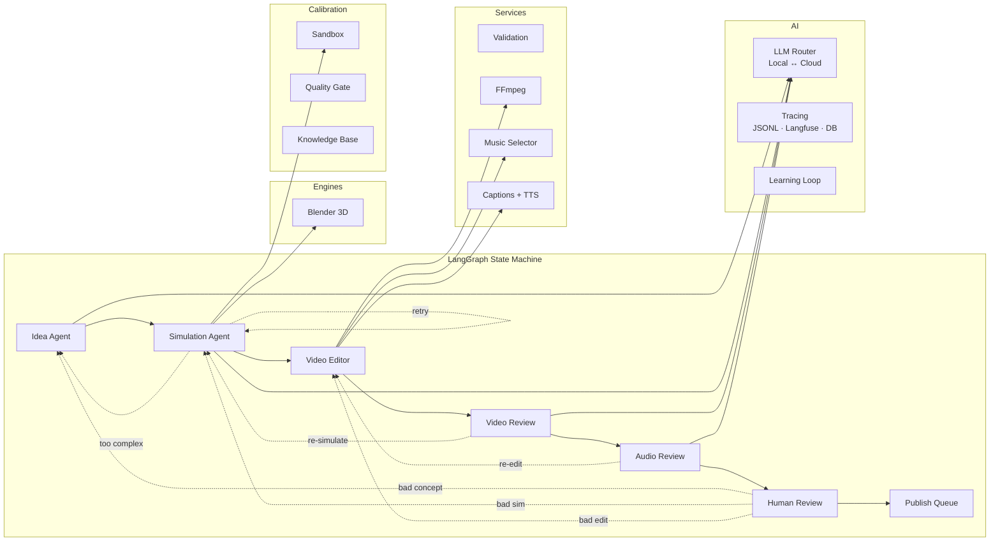

# Kairos Agent

**Autonomous AI pipeline that generates short-form simulation videos end-to-end** — from concept ideation through physics simulation, video assembly, quality review, and publishing.

LLM-powered agents orchestrated by LangGraph collaborate to produce satisfying 9:16 portrait physics videos (ball pits, domino chains, marble funnels, destruction scenes) with no human intervention required beyond a final approve/reject gate.

> **Status:** Active development. 825 tests passing. Physics, domino, and marble pipelines operational.

---

## Why This Project Exists

Kairos is a **genuine multi-agent system** where every agent makes real decisions:

- **Agents don't see each other's code.** The Idea Agent, Simulation Agent, and Video Editor are plain Python classes behind abstract interfaces. LangGraph orchestrates them, but they have zero framework dependency.
- **Agents iterate on failure.** A simulation that fails validation triggers full regeneration with accumulated error context. Video and audio quality gates route back to earlier agents when they detect problems.
- **The system learns.** Every successful cloud LLM call is stored as training data. Category knowledge accumulates in the database. Prompts are enriched with few-shot examples from verified runs.
- **Cost is managed.** Local Ollama models handle routine work; Claude is reserved for complex generation. Token counts and costs are tracked per-call and surfaced in traces and the dashboard.

---

## Architecture



### How a Run Works

1. **Idea Agent** — Analyses category stats (SQL, no LLM), selects the next category via programmatic rotation rules, then generates a `ConceptBrief` via Claude with Instructor structured output.
2. **Simulation Agent** — LLM generates a complete Blender Python script based on the concept brief and category constraints. Executes in a Docker sandbox. Validates output via programmatic checks. On failure, regenerates with accumulated error context. Retries up to 5 times.
3. **Video Editor Agent** — Selects music by mood tags, generates captions, assembles the final 9:16 video via FFmpeg.
4. **Video Review** — Vision LLM extracts frames and evaluates visual quality. Routes back to Simulation Agent if it detects problems.
5. **Audio Review** — Omni-modal LLM + FFmpeg ebur128 loudness analysis. Routes back to Video Editor if audio is poor.
6. **Human Review** — Pipeline pauses (LangGraph interrupt). Dashboard shows video + concept summary for one-click approve/reject.
7. **Publish** — Approved videos enter the distribution queue.

Every step is **cached by input hash** — reruns skip completed work at zero cost. Every LLM call is **traced** to JSONL files, Langfuse, and PostgreSQL simultaneously.

---

## Project Structure

```
src/kairos/
├── orchestrator/        # LangGraph graph, state, routing logic, registry
├── pipelines/           # Pipeline adapters + per-pipeline agents
│   ├── adapters/        #   @register_pipeline implementations
│   ├── physics/         #   Blender physics agents (ball pit, destruction)
│   ├── domino/          #   Blender domino agents + creative sub-pipeline
│   └── marble/          #   Blender marble agents + models
├── calibration/         # Sandbox execution, quality gate, ChromaDB knowledge base
├── ai/                  # AI layer (no business logic)
│   ├── llm/             #   LiteLLM routing, config, capabilities
│   ├── tracing/         #   RunTracer, event models, sinks (JSONL, Langfuse, DB)
│   ├── prompts/         #   Jinja2 templates per agent per pipeline
│   ├── review/          #   Shared video/audio review agents
│   └── learning/        #   Training data collection + few-shot injection
├── services/            # Engine-agnostic business logic
│   ├── validation.py    #   Two-tier video validation (programmatic + AI)
│   ├── async_subprocess.py  # Async FFmpeg/FFprobe utilities
│   ├── audio/           #   SFX pool, Freesound, synthetic, mixing
│   └── environment/     #   Blender environment theming
├── engines/             # Execution backends
│   └── blender/         #   Blender executor, configs, environment, scripts
├── skills/              # Domino + marble skill catalogues and contracts
├── tools/               # Pipeline stats, prompt harness
├── schemas/             # All Pydantic contracts (90+ models)
├── db/                  # SQLAlchemy models + async operations
├── api/                 # FastAPI app, REST routes, WebSocket streams
├── web/                 # Review dashboard (Jinja2 templates)
├── eval/                # Evaluation harness + regression tests
├── cli/                 # CLI entry points
└── config.py            # pydantic-settings from .env
```

---

## Quick Start

### Prerequisites

| Tool | Version | Notes |
|------|---------|-------|
| Python | 3.12+ | 3.13 tested |
| Docker + Compose | 4.x+ | For PostgreSQL + simulation sandbox |
| FFmpeg | 6.x+ | `winget install Gyan.FFmpeg` |
| Ollama | latest | For local LLMs (optional — cloud-only mode works) |

### Install

```bash
git clone https://github.com/thedebasser/kairos-agent.git
cd kairos-agent

cp .env.example .env           # Edit with your API keys
docker compose up -d postgres  # Start database

python -m venv .venv
.venv\Scripts\activate         # Windows
pip install -e ".[dev]"

docker build -t kairos-sandbox sandbox/  # Build simulation sandbox
```

### Run

```bash
pipeline run --pipeline physics    # Full autonomous run
pipeline run --pipeline domino     # Domino chain pipeline
pipeline status                    # Check running/completed
pipeline resume <run-id>           # Resume interrupted run
```

### Test

```bash
pytest tests/ -q --timeout=60     # Full suite (~825 tests)
pytest tests/unit/ -m unit        # Fast unit tests only
pytest tests/integration/         # Requires Docker services
```

---

## Design Decisions

Key architectural choices and the reasoning behind them. Full ADRs in [docs/adr/](docs/adr/).

| Decision | Choice | Why |
|----------|--------|-----|
| Agent ↔ orchestrator separation | Agents are plain classes behind ABCs; LangGraph only orchestrates | Agents are testable in isolation, swappable, and have no framework lock-in |
| LLM-generated Blender scripts | LLM generates complete Blender Python scripts per concept | Inline prompts with category constraints + error context on retry reduce hallucination |
| Local-first LLM routing | Ollama for routine work, Claude for generation | ~$0.02/run vs ~$0.15/run. Cloud responses become training data for local models |
| Pluggable tracing sinks | JSONL files + Langfuse + PostgreSQL in parallel | Files for debugging, Langfuse for dashboards, DB for queries. No single point of failure |
| Step-level input-hash caching | Each node hashes its relevant state fields | Reruns and retries skip completed work. Cache hit = zero cost, zero latency |
| Prompt templates as files | Jinja2 `.txt` files in `ai/prompts/` | Prompts are diffable, reviewable in PRs, and version-controlled like code |
| Two-tier validation | Tier 1: programmatic (FFprobe). Tier 2: AI (vision model) | Fast gate filters obvious failures. AI catches subtle quality issues |

---

## Cost Characteristics

| Scenario | Typical Cost | Model Mix |
|----------|-------------|-----------|
| Successful physics run (no retries) | ~$0.02 | Ollama local for config, Claude for concept |
| Physics run with 3 simulation retries | ~$0.06 | Extra generation calls with error context |
| Full cloud-only run | ~$0.15 | All calls to Claude |
| Eval suite (10 cases) | ~$0.30 | Concept + simulation for each |

Token counts and costs are tracked per-call via `_extract_usage()` and surfaced in traces, the database, and the dashboard.

---

## Known Limitations

- **Marble pipeline** is under redesign — ramp geometry and Blender camera placement need work.
- **Tier 2 validation** (AI frame inspection) is implemented but the original vision model (`moondream2`) was removed from Ollama's registry. Qwen3-VL is used for video review instead.
- **Publishing** is queue-ready but platform adapters (TikTok, YouTube Shorts, Instagram Reels) are not yet implemented.
- **Windows-primary development** — tested on Windows 11 with WSL2 Docker. Linux/macOS should work but isn't CI-verified.
- Two `test_graph.py` ordering-dependent tests fail when run in the full suite but pass in isolation.

---

## Documentation

| Document | Description |
|----------|-------------|
| [docs/architecture.md](docs/architecture.md) | Deep technical walkthrough of every layer |
| [docs/lessons-learned.md](docs/lessons-learned.md) | Honest post-mortem: what worked, what didn't, what I'd change |
| [docs/adr/](docs/adr/) | Architecture Decision Records for every major choice |
| [docs/agent-reference.md](docs/agent-reference.md) | Per-agent reference: prompts, models, call patterns |
| [docs/setup-guide.md](docs/setup-guide.md) | Detailed new-machine setup walkthrough |
| [docs/refactor-design-doc.md](docs/refactor-design-doc.md) | The 5-phase refactor plan that shaped this codebase |
| [CONTRIBUTING.md](CONTRIBUTING.md) | Development workflow, conventions, testing |

---

## Tech Stack

| Layer | Technology |
|-------|-----------|
| Orchestration | LangGraph 0.3 |
| LLM routing | LiteLLM + Instructor (structured output) |
| Models | Claude Sonnet (cloud), Mistral 7B / Llama 3.1 8B (local via Ollama) |
| Simulation | Blender 4.x (all pipelines: physics, domino, marble) |
| Video | FFmpeg (composition, validation, frame extraction) |
| Database | PostgreSQL 16 + SQLAlchemy 2 (async) + Alembic |
| API | FastAPI + WebSocket (live event streaming) |
| Tracing | Custom RunTracer → JSONL files, Langfuse, PostgreSQL |
| Testing | pytest + pytest-asyncio (825 tests, ~50s) |
| Config | pydantic-settings from `.env` |

---

## License

MIT
