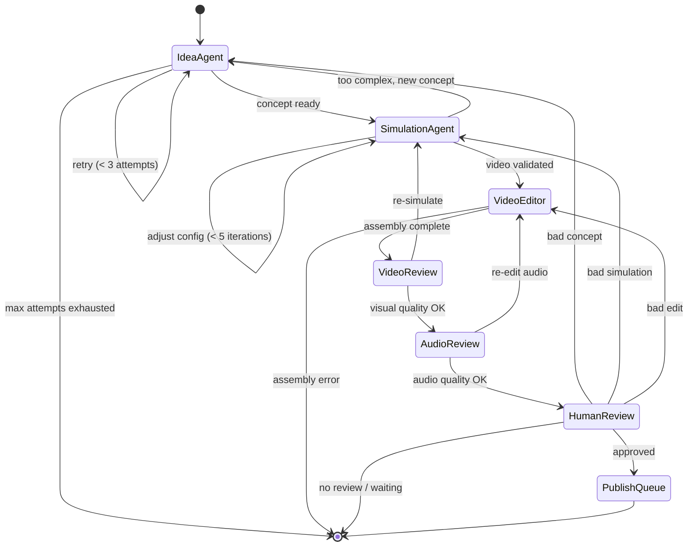
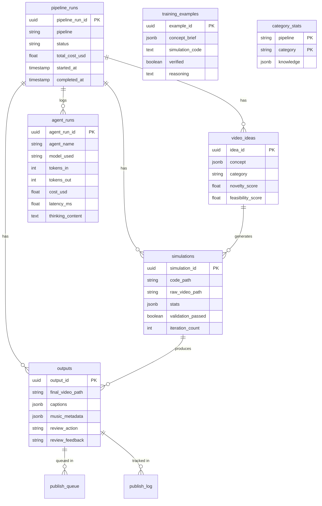

# Kairos Agent — Architecture

Deep technical walkthrough of every layer in the system. For the high-level overview, see the [README](../README.md).

---

## Table of Contents

1. [System Overview](#1-system-overview)
2. [Orchestration Layer](#2-orchestration-layer)
3. [Pipeline Adapter Pattern](#3-pipeline-adapter-pattern)
4. [Agent Layer](#4-agent-layer)
5. [AI Layer](#5-ai-layer)
6. [Service Layer](#6-service-layer)
7. [Engine Layer](#7-engine-layer)
8. [Data Layer](#8-data-layer)
9. [API & Dashboard](#9-api--dashboard)
10. [Observability](#10-observability)
11. [Configuration](#11-configuration)
12. [Testing Strategy](#12-testing-strategy)

---

## 1. System Overview

Kairos Agent is structured as a layered architecture with strict dependency rules:

```
┌────────────────────────────────────────────────────────┐
│  CLI / API / Dashboard                                 │  ← Entry points
├────────────────────────────────────────────────────────┤
│  Orchestrator (LangGraph state machine)                │  ← Workflow coordination
├────────────────────────────────────────────────────────┤
│  Pipeline Adapters        │  Agents (plain Python)     │  ← Business logic
├───────────────────────────┼────────────────────────────┤
│  AI Layer                 │  Service Layer             │  ← Capabilities
│  (LLM routing, tracing,  │  (validation, FFmpeg,      │
│   prompts, learning)      │   audio, captions)         │
├───────────────────────────┼────────────────────────────┤
│  Engine Layer             │  Data Layer                │  ← Execution & storage
│  (Pymunk sandbox,         │  (PostgreSQL, SQLAlchemy,  │
│   Blender subprocess)     │   Alembic)                 │
└───────────────────────────┴────────────────────────────┘
```

**Dependency rule:** Each layer may only import from the layer below it. Agents never import from the orchestrator. The orchestrator never imports from the API layer. This is enforced by convention and validated by test collection (circular imports break pytest).

---

## 2. Orchestration Layer

**Location:** `src/kairos/orchestrator/`

### State Machine

The pipeline is a LangGraph `StateGraph` with 7 nodes and conditional edges:



### State Schema

`PipelineGraphState` is a `TypedDict` carrying all data between nodes:

| Field | Type | Description |
|-------|------|-------------|
| `pipeline_run_id` | `str` | UUID for the run |
| `pipeline` | `str` | Pipeline name (physics, domino, marble) |
| `status` | `str` | Current pipeline status |
| `concept` | `dict` | Serialized `ConceptBrief` |
| `concept_attempts` | `int` | Number of idea generation attempts |
| `simulation_code` | `str` | Generated simulation source code |
| `simulation_result` | `dict` | Execution result from sandbox |
| `validation_result` | `dict` | Validation check results |
| `simulation_iteration` | `int` | Current iteration (max 5) |
| `raw_video_path` | `str` | Path to raw simulation output |
| `final_video_path` | `str` | Path to assembled final video |
| `video_review_result` | `dict` | Vision LLM quality assessment |
| `audio_review_result` | `dict` | Audio quality assessment |
| `review_action` | `str` | Human review decision |
| `total_cost_usd` | `float` | Accumulated LLM cost |
| `errors` | `list[str]` | Error messages for debugging |

A startup assertion (`_assert_state_parity()`) cross-checks fields between `PipelineGraphState` (TypedDict) and the Pydantic `PipelineState` model to catch drift.

### Step Caching

Each node computes an `_state_input_hash` of its relevant input fields before execution. If a cache entry exists with a matching hash, the cached result is returned immediately. This means:

- **Reruns are free.** Resuming a failed run skips all completed steps.
- **Retries only pay for the retry.** If simulation iteration 3 fails but 1-2 succeeded, only 3 re-executes.
- **Cache keys are content-addressed.** Two runs with identical inputs produce the same hash.

### Checkpointing

The graph supports two checkpointers:

| Checkpointer | Use Case |
|--------------|----------|
| `MemorySaver` | Default. In-memory, lost on process exit. Fine for development. |
| `AsyncPostgresSaver` | Production. Survives restarts. Enables `pipeline resume <id>`. |

### Routing Functions

Six routing functions determine the next node after each step:

- `route_after_idea` — success → simulation, retry → idea_agent (< 3 attempts), exhausted → END
- `route_after_simulation` — validated → video_editor, failed → simulation (< 5 iterations), too complex → idea_agent
- `route_after_video_editor` — assembled → video_review, error → END
- `route_after_video_review` — pass → audio_review, fail → simulation_agent (re-simulate)
- `route_after_audio_review` — pass → human_review, fail → video_editor (re-edit)
- `route_after_review` — approved → publish, bad_concept → idea, bad_sim → simulation, bad_edit → video_editor, waiting → END

---

## 3. Pipeline Adapter Pattern

**Location:** `src/kairos/pipelines/`

### Contracts

`contracts.py` defines 6 ABCs that every pipeline must implement:

```python
class PipelineAdapter(ABC):
    """Top-level adapter — factory for all agents."""
    pipeline_name: str
    engine_name: str
    categories: list[ScenarioCategory]

    def get_idea_agent(self) -> IdeaAgent: ...
    def get_simulation_agent(self) -> SimulationAgent: ...
    def get_video_editor_agent(self) -> VideoEditorAgent: ...
    # ... plus review agents, health_check, etc.
```

Agent ABCs: `IdeaAgent`, `SimulationAgent`, `VideoEditorAgent`, `VideoReviewAgent`, `AudioReviewAgent`.

### Registry

Adapters are registered via `@register_pipeline("physics")` decorator. The registry auto-discovers all sub-packages of `kairos.pipelines` at first access:

```python
@register_pipeline("physics")
class PhysicsPipelineAdapter(PipelineAdapter):
    pipeline_name = "physics"
    engine_name = "pymunk"
    ...
```

**Adding a new pipeline** = creating a new adapter class in `pipelines/adapters/` + implementing the agent ABCs. No changes to the orchestrator needed.

### Registered Pipelines

| Pipeline | Engine | Status | Categories |
|----------|--------|--------|------------|
| `physics` | Pygame + Pymunk | Active (primary) | BALL_PIT, DESTRUCTION |
| `domino` | Blender 3D | Active | DOMINO_CHAIN |
| `marble` | Blender 3D | Under redesign | MARBLE_FUNNEL |

---

## 4. Agent Layer

Agents are **plain Python classes** with no dependency on LangGraph, FastAPI, or any framework. They implement the ABCs from `contracts.py` and are injected into the orchestrator via pipeline adapters.

### Idea Agent (Physics)

Three sub-agents collaborating:

1. **Inventory Analyst** — Pure SQL. Queries `category_stats` to build an `InventoryReport`. No LLM call.
2. **Category Selector** — Programmatic rules engine implementing the rotation policy:
   - Hard block: no immediate repeat of previous category
   - Streak break: force switch after 3 consecutive same-category
   - Soft block: deprioritise categories >30% of last 30 days
   - Boost: promote categories with <5 total videos
3. **Concept Developer** — Claude Sonnet via Instructor. Generates a `ConceptBrief` with visual brief, simulation requirements, and audio mood.

### Simulation Agent (Physics)

**Config-based template architecture** — the key architectural choice that reduces hallucination:

1. LLM generates a **JSON config** matching a per-category schema (e.g., `BallPitConfig`, `DestructionConfig`)
2. A fixed Python template per category renders the config into runnable Pygame+Pymunk code
3. Headless pre-validation checks chain completion before render
4. On failure, the LLM adjusts the **config** (not the code) — a much smaller, constrained search space

The simulation loop:
```
generate_config → render_template → execute_in_sandbox → validate
     ↑                                                      │
     └──────── adjust_config (up to 5 iterations) ──────────┘
```

**Learning loop integration:** The prompt is enriched with:
- Few-shot examples from verified training data (`training_examples` table)
- Category-specific knowledge from `category_stats.knowledge`
- Static validation rules (resolution, duration, FPS requirements)

### Video Editor Agent

Orchestrates three tasks:
1. `select_music()` — Tag/mood matching from curated library
2. `generate_captions()` — Claude generates hook text + timestamps
3. `compose_video()` — FFmpeg assembly: raw video + captions + music + TTS → final 9:16 MP4

---

## 5. AI Layer

**Location:** `src/kairos/ai/`

### LLM Routing (`ai/llm/`)

The routing layer abstracts all LLM access behind three call patterns:

| Function | Pattern | When Used |
|----------|---------|-----------|
| `call_llm()` | Single model, structured output (Instructor) | Standard agent calls |
| `call_llm_code()` | Single model, raw response + manual parse | Code-heavy responses where TOOLS mode adds overhead |
| `call_with_quality_fallback()` | Local → cloud escalation | Generation steps where local quality varies |
| `call_ollama_direct()` | Direct Ollama HTTP | Thinking models where LiteLLM drops content |

**Quality fallback flow:**
```
call_with_quality_fallback(primary=local, fallback=cloud)
  ├── Try local model (300s timeout)
  │     ├── Success + validator passes → return result
  │     └── Failure or validator fails → try cloud
  └── Try cloud model (120s timeout)
        ├── Success → return result + store as training data
        └── Failure → raise
```

When `use_local_llms: false`, the local attempt is skipped entirely (primary == fallback → fast path).

### Model Configuration (`ai/llm/config.py`)

`llm_config.yaml` maps each pipeline step to model aliases:

```yaml
steps:
  concept-developer:
    litellm_alias_local: "ollama/mistral:7b-instruct-q4_0"
    litellm_alias_cloud: "concept-developer"  # → claude-sonnet-4-6
    call_pattern: "quality_fallback"
```

`StepConfig` resolves which models to use based on the `use_local_llms` toggle.

### Model Capabilities (`ai/llm/capabilities.py`)

Per-model-family classes handle provider differences:

- `AnthropicCapabilities` — Extended thinking via `thinking` parameter, token-based pricing
- `OllamaCapabilities` — JSON mode via `format: "json"`, $0 pricing
- `OpenAICapabilities` — Standard OpenAI API, function calling mode

Each provides: `get_instructor_mode()`, `get_thinking_param()`, `get_extra_call_params()`, `extract_usage()`, `pricing_per_1k_tokens`.

### Prompt System (`ai/prompts/`)

Prompts are Jinja2 `.txt` files organized by pipeline and role:

```
ai/prompts/
├── physics/
│   ├── system/
│   │   ├── concept_developer.txt
│   │   └── simulation_config.txt
│   └── user/
│       ├── concept_developer.txt
│       └── simulation_config.txt
├── domino/
│   └── ...
└── shared/
    └── ...
```

Templates are rendered with pipeline-specific variables by builder modules (e.g., `prompts/physics/builder.py`). Variable injection is explicit — no hidden string formatting.

### Learning Loop (`ai/learning/`)

Accumulates experience over time:

1. **Training data capture** — Every successful cloud LLM call stores its input/output in `training_examples` (with `verified=false`).
2. **Verification gate** — Training examples must be marked `verified=true` before they're injected into prompts. This prevents garbage from poisoning future runs.
3. **Category knowledge** — `category_stats.knowledge` (JSONB) stores per-category success patterns, common failure modes, and adjustment heuristics.
4. **Few-shot injection** — Verified examples are retrieved by category and injected into concept and simulation prompts.

### Thinking Buffer

A module-level `_thinking_buffer` accumulates extended thinking content from LLM calls. After each graph node executes, `collect_thinking()` drains the buffer and attaches it to the step trace. This gives visibility into the agent's reasoning without cluttering the response.

### LLM Call Buffer (Receipt Box)

Similarly, `_llm_call_buffer` + `collect_llm_calls()` captures structured records of every LLM call (model, tokens, cost, latency) for tracing and DB persistence. Each graph node drains after execution.

---

## 6. Service Layer

**Location:** `src/kairos/services/`

Engine-agnostic business logic shared across all pipelines:

| Service | Purpose | Key Pattern |
|---------|---------|-------------|
| `validation.py` | Two-tier video validation | Tier 1: 5 FFprobe checks (format, duration, resolution, FPS, audio). Tier 2: AI frame inspection. All async. |
| `async_subprocess.py` | Non-blocking subprocess execution | `run_async()` wraps `asyncio.create_subprocess_exec`. `run_ffprobe_json()` for structured probe output. |
| `ffmpeg_compositor.py` | Final video assembly | Combines raw video + captions + music + TTS into 9:16 MP4 |
| `music_selector.py` | Curated music selection | Tag/mood matching against `music/metadata.json` |
| `caption.py` | FFmpeg drawtext captions | Burn-in text overlays with timing |
| `tts.py` | Text-to-speech | Edge-TTS for hook narration |
| `screenshot_analyzer.py` | Visual quality analysis | Frame extraction + vision model assessment |
| `category_rotation.py` | Category selection rules | Hard block, streak break, soft block, boost |
| `audio/` | Audio processing | SFX pool, Freesound integration, synthetic SFX, FFmpeg mixing |
| `environment/` | Blender environments | Theme catalogue, HDRI loading, texture management |

### Validation Engine

The validation engine implements a two-tier strategy:

**Tier 1 (programmatic, ~100ms):**
- `check_valid_mp4()` — FFprobe can parse the file
- `check_file_size()` — File is >10KB (not empty/corrupt)
- `check_duration()` — Within 62-68s target range
- `check_resolution()` — 1080x1920 (9:16 portrait)
- `check_fps()` — Consistent 30fps

**Tier 2 (AI, ~5s):**
- Frame extraction at key timestamps
- Vision model assessment of visual quality
- Blank frame detection

All Tier 1 checks must pass before Tier 2 runs. Results are returned as a `ValidationResult` with per-check details.

---

## 7. Engine Layer

**Location:** `src/kairos/engines/`

### Pymunk Sandbox (`engines/pymunk/`)

Agent-generated Pygame+Pymunk code executes in a Docker container with strict isolation:

| Constraint | Value |
|-----------|-------|
| Network | Disabled |
| Memory | 4GB |
| CPUs | 2 |
| Timeout | 300s |
| Filesystem | Temp directory mounted read-write |

Execution is fully async via `asyncio.create_subprocess_exec`. The sandbox captures:
- Exit code and stderr (for debugging)
- Output video file (if successful)
- Execution duration and resource usage

Custom exception hierarchy: `SimulationTimeoutError`, `SimulationOOMError`, `SimulationExecutionError`.

### Blender Engine (`engines/blender/`)

For domino and marble pipelines. Orchestrates Blender as a subprocess with:
- Scene setup via Python scripts
- HDRI environment loading
- Camera placement and animation
- Render to video frames + FFmpeg assembly

---

## 8. Data Layer

**Location:** `src/kairos/db/`

### Database Schema

PostgreSQL 16 with SQLAlchemy 2 (async) and Alembic migrations.



All cross-table references have `ForeignKey` constraints with `ON DELETE CASCADE`.

### Async Session Management

Sessions are created via `async_session_factory()` using `asyncpg` as the async driver. The factory is a singleton bound to `get_settings().database_url`.

### Migrations

Alembic is configured with async support. Migration template at `alembic/`. Historical SQL migrations in `migrations/` (001-005) are preserved for reference.

---

## 9. API & Dashboard

**Location:** `src/kairos/api/` and `src/kairos/web/`

### REST API

FastAPI app created via factory pattern (`create_app()`):

| Route | Method | Description |
|-------|--------|-------------|
| `/api/runs` | GET | Paginated run list with pipeline/status filters |
| `/api/runs/{run_id}` | GET | Run detail + file artifacts |
| `/api/runs/{run_id}/events` | GET | Event timeline for a run |
| `/api/pipeline/start` | POST | Start new pipeline run (async background) |
| `/api/pipeline/status` | GET | Available pipelines and their status |
| `/api/health` | GET | Database connectivity check |

### WebSocket Streams

| Endpoint | Description |
|----------|-------------|
| `/ws/runs/{run_id}` | Per-run live event tail |
| `/ws/events` | Global broadcast of all events |

Protocol: JSON messages with `type` field (`event`, `ping`, `pong`, `complete`).

### Review Dashboard

Mounted at `/review` as a sub-application. Server-rendered with Jinja2:
- Inline video player with concept summary
- One-click approve/reject with reason codes
- Queue navigation (previous/next)
- Optional feedback text field
- Discord webhook notification on new reviews

---

## 10. Observability

**Location:** `src/kairos/ai/tracing/`

### Architecture

```
Graph Node executes
  └── RunTracer.step() context manager
        ├── emits StepStarted event
        ├── Agent code runs
        │     └── LLM calls emit LLMCallStarted/Completed
        ├── collect_thinking() drains thinking buffer
        ├── collect_llm_calls() drains call buffer
        └── emits StepCompleted event

Events flow through TracingSink implementations:
  ├── RunFileWriter → JSONL files (runs/<id>/events.jsonl)
  ├── LangfuseSink → Langfuse traces + MetricsStore + AlertManager
  └── DatabaseSink → PostgreSQL (agent_runs, pipeline_runs)
```

### Event Types

10 strongly-typed event models (all extend `TraceEvent`):

| Event | Emitted When |
|-------|-------------|
| `RunStarted` | Pipeline run begins |
| `RunCompleted` | Pipeline run ends (success or failure) |
| `StepStarted` | Graph node begins execution |
| `StepCompleted` | Graph node finishes |
| `LLMCallStarted` | LLM request sent |
| `LLMCallCompleted` | LLM response received |
| `PromptRendered` | Prompt template rendered with variables |
| `Decision` | Agent makes a routing/logic decision |
| `ConsoleMessage` | Human-readable status message |

All events carry `run_id` and `event_id` for join/trace. Timestamps are UTC.

### Run Artifacts

```
runs/<job_id>/
├── events.jsonl            # Machine-readable lifecycle events
├── console.jsonl           # Human-readable real-time feed
├── steps/
│   └── NN_step_name/
│       ├── decisions.jsonl # Agent reasoning chains
│       └── prompts/
│           ├── NNN_request.json
│           └── NNN_response.json
└── assets/
    └── v{N}/               # Versioned output directory
```

---

## 11. Configuration

**Location:** `src/kairos/config.py`

`Settings(BaseSettings)` via pydantic-settings, loaded from `.env`:

| Category | Key Settings |
|----------|-------------|
| **LLM** | `anthropic_api_key`, `ollama_base_url`, `litellm_config_path` |
| **Database** | `postgres_host`, `postgres_port`, `postgres_db` → auto-derived `database_url` |
| **Sandbox** | `sandbox_timeout_sec` (300), `sandbox_memory_limit` (4g), `sandbox_cpu_limit` (2) |
| **Pipeline** | `target_duration_sec` (65), `target_fps` (30), `target_resolution` (1080x1920) |
| **Observability** | `langfuse_public_key`, `langfuse_secret_key`, `discord_webhook_url` |
| **Cost** | `cost_alert_threshold_usd` (0.30 rolling avg) |
| **Paths** | `project_root` (auto-detected), `knowledge_dir`, `music_dir`, `output_dir` |
| **FFmpeg** | `ffmpeg_path`, `ffprobe_path` — auto-resolved via env var → `shutil.which` → known locations |

Singleton pattern: `get_settings()` returns a cached instance.

LLM model routing is separately configured in `llm_config.yaml` with per-step model aliases and the `use_local_llms` toggle.

---

## 12. Testing Strategy

**600 tests, ~50 seconds.**

| Layer | Count | Strategy |
|-------|-------|----------|
| Unit (`tests/unit/`) | ~400 | Mock all I/O. Test agents, models, services in isolation. |
| Integration (`tests/integration/`) | ~30 | Require Docker services. Test sandbox execution, DB operations, LLM routing. |
| Pipeline (`tests/pipelines/`) | ~30 | Test pipeline adapter contracts, category coverage, template rendering. |
| Quality (`tests/quality/`) | ~10 | Validate video output characteristics. |
| Golden set (`tests/golden_set/`) | ~15 | Regression tests against known-good outputs. |
| Eval (`src/kairos/eval/`) | Separate | Curated test cases run through full pipeline. Cost-aware — not in CI. |

### Key Testing Patterns

- **Abstract tests for abstract contracts:** `test_pipeline_interface.py` auto-discovers all registered pipelines and verifies they implement every ABC method.
- **AsyncMock throughout:** All agent methods are async. Tests use `pytest-asyncio` with `mode=auto`.
- **No network in unit tests:** LLM calls are mocked. Sandbox tests use pre-built fixtures.
- **Eval harness is separate from pytest:** `eval/harness.py` loads cases from YAML, runs through the real pipeline, and measures pass rate + cost. This is the regression testing framework — not run in CI because it costs real money.
